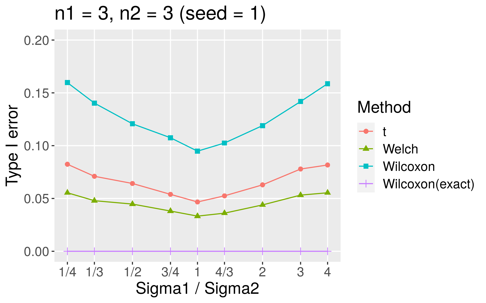
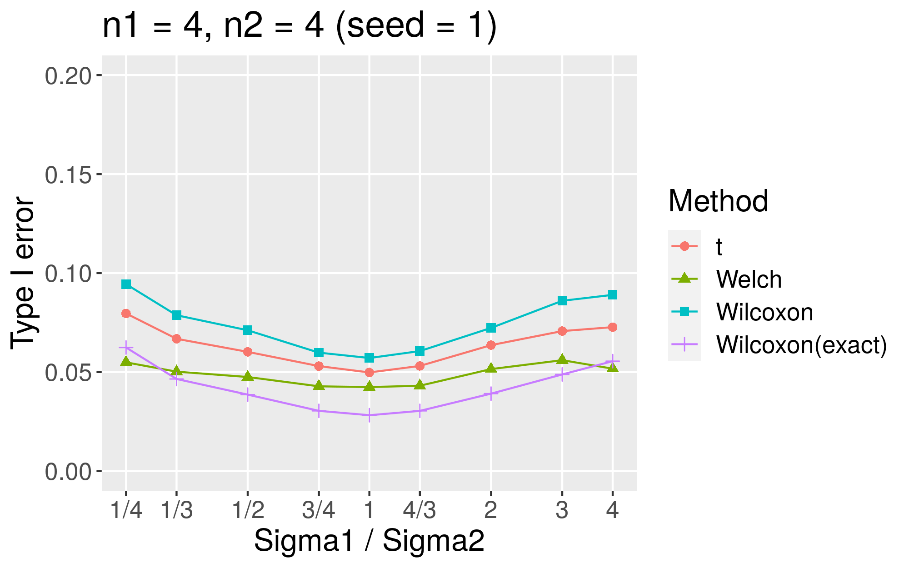
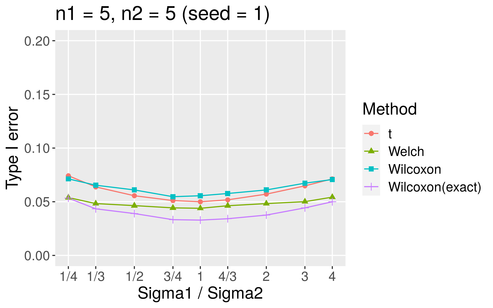
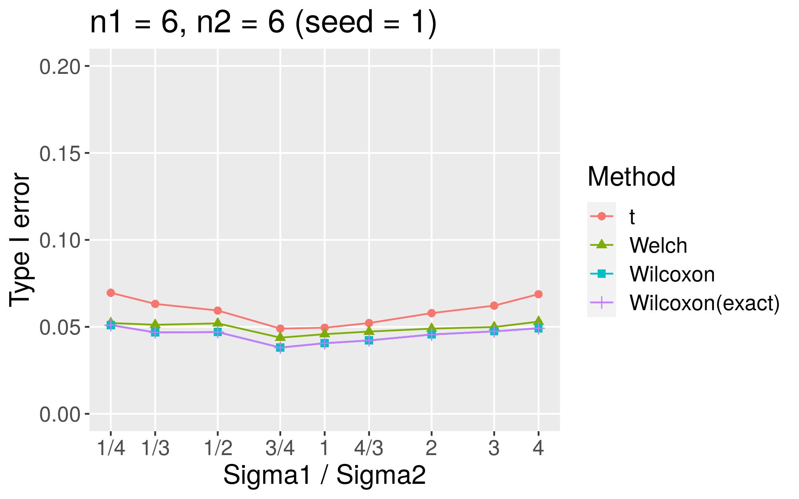
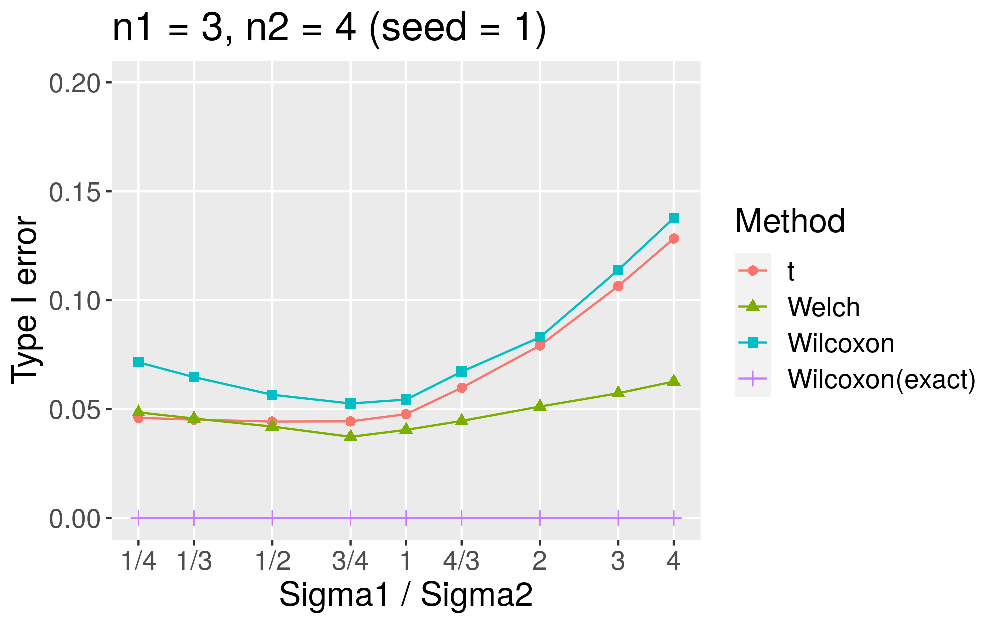
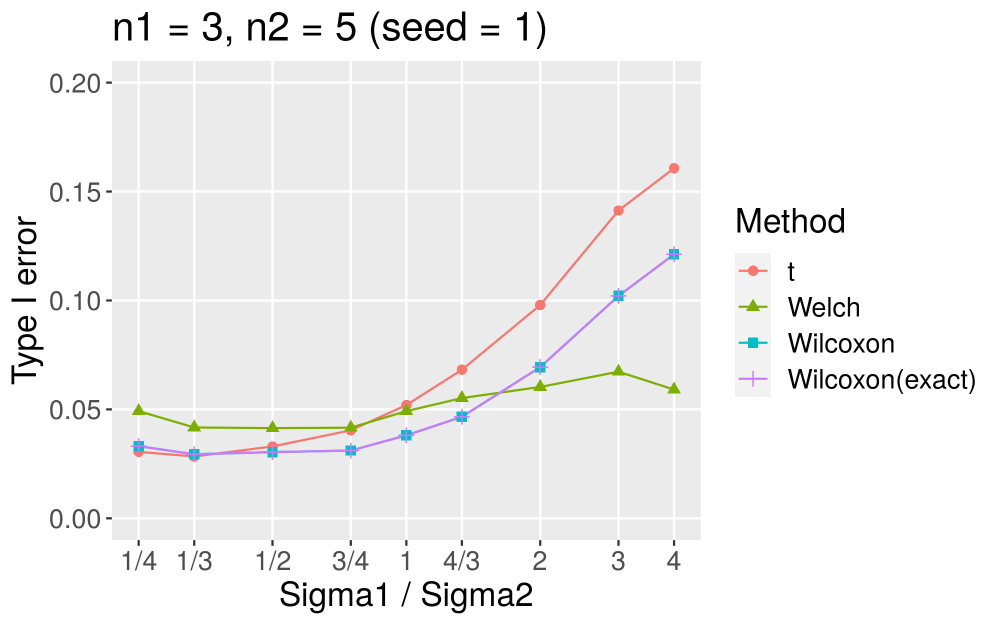
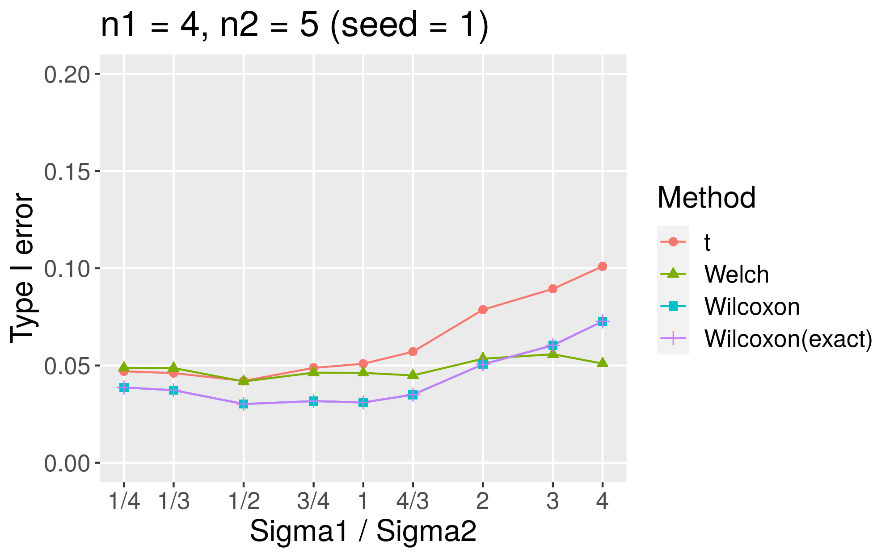

# Introduction

I have interest in type I error of Welch test in **small** sample size.
In this simulation,
I show type I error of *t*-test and Wilcoxon runk-sum test
 in small sample size.

# Condition
## Distribution
Normal distribution

- Mean of each group is 10.
- Sigma of Group1 is 1/4, 1/3, 1/2, 3/4, 1, 4/3, 2, 3, 4.
- Sigma of Group2 is 1.

## Calculation of Type I Error
1. Each sample is generated by `rnorm` function.
   - Each sample size is n1 and n2.
1. P value is calculated by several methods.
1. Number of iteration is 10,000.
1. **Type I Error** is calculated in each condition.
   - The ratio of tests that result in *P* < 0.05

## Using methods of statistical test
1. *t*-test
   - `t.test` with `var.equal = TRUE` option
1. Welch test
   - `t.test`
1. Wilcoxon runk-sum test
   - `wilcox_test` in `coin` package
1. exact Wilcoxon runk-sum test
   - `wilcox_test` in `coin` package with `distribution = "exact"` option

# Result of Monte Carlo simulation
## balanced sample size (n1 = n2)
### n1 = 3, n2 = 3

### n1 = 4, n2 = 4

### n1 = 5, n2 = 5

### n1 = 6, n2 = 6

## unbalanced sample size (n1 < n2)
### n1 = 3, n2 = 4

### n1 = 3, n2 = 5

### n1 = 4, n2 = 5

